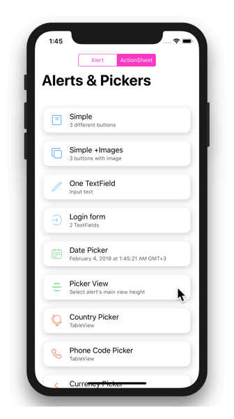
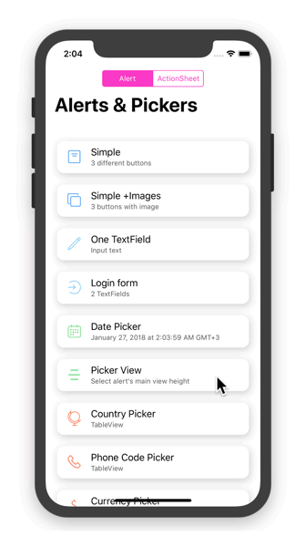

참고한 깃허브 링크   
https://github.com/jdzorz/SimpleAlertPickers


## PickerView

Example how to use `UIPickerView` as `contentViewController` and change height of the `UIAlertController`.

<div align = "center">


</div>

```swift
let alert = UIAlertController(style: .actionSheet, title: "Picker View", message: "Preferred Content Height")

let frameSizes: [CGFloat] = (150...400).map { CGFloat($0) }
let pickerViewValues: [[String]] = [frameSizes.map { Int($0).description }]
let pickerViewSelectedValue: PickerViewViewController.Index = (column: 0, row: frameSizes.index(of: 216) ?? 0)

alert.addPickerView(values: pickerViewValues, initialSelection: pickerViewSelectedValue) { vc, picker, index, values in
    DispatchQueue.main.async {
        UIView.animate(withDuration: 1) {
            vc.preferredContentSize.height = frameSizes[index.row]
        }
    }
}
alert.addAction(title: "Done", style: .cancel)
alert.show()
```

## Installing

#### CocoaPods

```ruby
pod 'SimpleAlertPickers'
```
